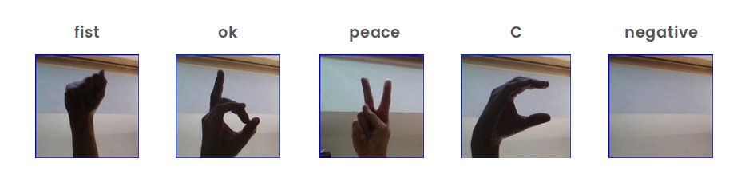
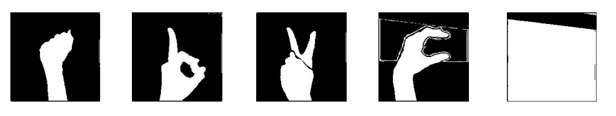
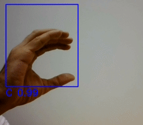

# Ironhack Final Project - Devices control based on hand gesture

The following lines describe the creation of a model that detect some gestures through the camera to do some actions in the computer.

The model is a Sequential Neural Network make it with Keras.

This work was made it like final project of [Ironhack](https://www.ironhack.com), an intensive 9-week bootcamp of data analytics.

## Files and folders

 * **model.ipynb** - Notebook where the model has been made it.
 * **main.py** - Main file that use OpenCV to catch the images and use the model created it before to identify the gestures.
 * **images** -  Folder with all the images use it in the project (take it from a Kaggle dataset). 
 * **logs** -  Folder with the logs generated with the Keras model. 
 * **models** -  Folder with the models created with keras. 
 * **pickles** -  Folder with the input arrays (X and y). If necessary, we can take it to train a model in other platform (Google Colab, for example).
 
# The dataset

We have worked with 4 gestures: fist, ok, peace and C and negatives images (images where there are not hands).

## Cleaning the dataset
 
To create a prediction model more solid, we are going to simplificate the images. We need to binarize it: Make the hand white and the background, black.

To binarize it, we are going to take value of the middle pixel (we assume that the hands are centered). After, we convert all the pixel in range of +-50 to white, and the rest to black.

# The model

The model is a Convolutional Neural Network make it with keras. The structure is as follows:

`# Construction of model

model = Sequential()

model.add(Conv2D(128, (5, 5), activation='relu', input_shape=(200, 200, 1))) 

model.add(MaxPooling2D((2, 2)))

model.add(Conv2D(64, (3, 3), activation='relu')) 

model.add(MaxPooling2D((2, 2)))

model.add(Conv2D(32, (3, 3), activation='relu'))

model.add(MaxPooling2D((2, 2)))

model.add(Flatten())

model.add(Dense(128, activation='relu'))

model.add(Dense(5, activation='softmax'))

model.compile(optimizer='adam', loss='categorical_crossentropy', metrics=['accuracy'])`

We are checked that with 5 epochs and 1000 steps per epoch is enought.

# Performance

To make run the model we are going to capture the images with the webcam using **OpenCV**. In particular, we capture a ROI (Region Of Interest) where we apply the model to identify the hand gesture.

The actions programmed according to the gesture are:

* **Fist**: Make a *git add, git commit and git push*.
* **OK**: Open a webbrowser.
* **Peace**: Open Spotify. This time, the action of each gesture change this way:
    * **Fist**: Next song.
    * **OK**: Previous song.
    * **Peace**: Play/pause.
    * **C**: Exit (close Spotify).
* **C**: Exit (close OpenCV).

To more information, you can check the files *model.ipynb* or *main.py*.

# To do's

* The model has been trained with a white wall in the background, so to run it, it's necessary a white background.
* The model is very sensitive to light and in some situations does not recognize the gesture correctly. Often, you can fix it change it the parameter `tolerancia` in the file main.py
* The logs files have an enconding error. 

To improve the model it's necessary to train it with more images with different brightness and backgrounds.

